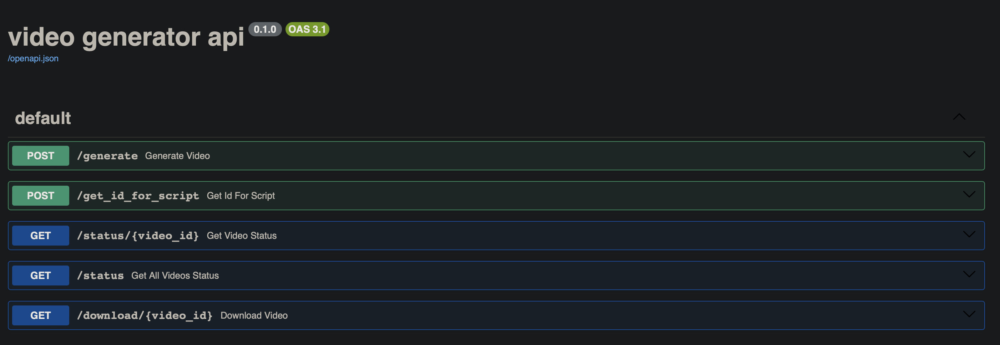

[](https://github.com/JustinGuese/docker-video-audio-generator-api/actions/workflows/main.yml)

Similar to https://github.com/harry0703/MoneyPrinterTurbo/blob/main/README-en.md, I want to generate a Video with subtitles and voiceover given a script. 

Example Result:


[example video](docs/ApnJY3tXITXxQg.mp4)

MoneyPrinterTurbo did some things inefficiently, so I want to improve upon it.

For starters, the videos are cached on disk, instead of loading them from pixabay every time.

## install

copy the [.env.example](.env.example) to .env and fill in the PIXABAY_API_KEY. you can get it for free at https://pixabay.com

### docker

`docker-compose up`

image: https://hub.docker.com/repository/docker/guestros/video-generation-api/

### local python

`poetry install`

for the api
`poetry run uvicorn main:app --reload`

for the python script have a look at [src/createVideo.py](src/createVideo.py)
e.g. `poetry run python src/createVideo.py`

i have included a vscode launch.json in which you can switch between file and api (uvicorn) mode easily.

### kubernetes

fill in the .env file as described above, and generate the pixybay secret with:
`kubectl create namesapce video-creator`
`kubectl create secret generic pixabay-secret --from-env-file=.env -n video-creator`

and then apply the k8s files with
`kubectl apply -f kubernetes/`

## usage

the app allows to create videos in two ways. one is using the api, and the other is using the python script.

### api usage

The api is accessible at http://localhost:8000/docs

OpenApi Spec: [openapi.json](openapi.json)




### python usage

check out [src/createVideo.py](src/createVideo.py) for an example of how to use the api.

```python
script = """Adobe is set to enhance video editing with the upcoming Firefly Video Model, streamlining creative workflows in Premiere Pro. Mistral's launch of the Pixtral 12B multimodal model marks a significant advance in AI capabilities, particularly for those looking to integrate image and text processing."""
createFullVideo("ApnJY3tXITXxQg", script, "technology")
```

it will create three folders

1. videos
    - contains the cached videos organized according to topic 
    - recommended to be persistent
2. workdir
    - should not be persistent, contains working files
3. output
    - contains the final video
